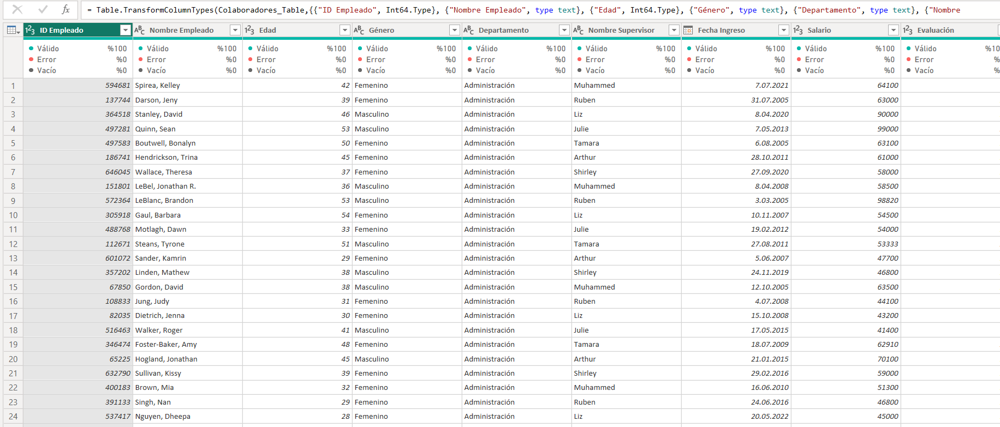
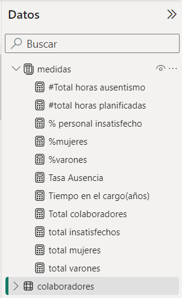
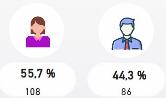

# 📘 Informe de Recursos Humanos con Power BI

Este proyecto consiste en el desarrollo de un **dashboard interactivo utilizando Power BI**, con el propósito de explorar y analizar los **gastos del área de Recursos Humanos entre enero y agosto de 2024**. La visualización permite obtener una comprensión clara del comportamiento presupuestario durante este período.

---

## 🔹 Introducción

El área de Recursos Humanos es fundamental dentro de cualquier organización, ya que se encarga de gestionar todos los aspectos relacionados con el personal. Esto abarca procesos como:

- Reclutamiento
- Selección
- Contratación
- Inducción
- Capacitación
- Desarrollo
- Remuneraciones
- Desvinculaciones

Una gestión eficiente del talento humano permite comprender y dirigir el comportamiento de los colaboradores dentro del entorno laboral. Al aplicar estrategias adecuadas, se facilita tanto la atracción como la retención de talento, contribuyendo así a un ambiente laboral positivo, mayor productividad y crecimiento sostenido de la empresa.

---

## 🎯 Objetivo

El propósito de este proyecto fue realizar un **análisis de datos enfocado en Recursos Humanos**, extrayendo indicadores clave y desarrollando un **dashboard interactivo con Power BI**, basado en información de una empresa peruana ficticia.

---

## 📊 Indicadores Clave Identificados

El dashboard permite una visión general de la gestión del capital humano, con el objetivo de detectar oportunidades de mejora. Algunos de los indicadores destacados son:

- Distribución de colaboradores por género (porcentaje y cantidad)
- Antigüedad promedio en el cargo (en años)
- Nivel de satisfacción del personal
- Tasa de ausentismo
- Promedio de evaluación del desempeño
- Costo total de planilla

---

## 🗂️ Fuente de Datos

Los datos utilizados provienen de un archivo Excel con los siguientes campos:

- ID del empleado
- Nombre y edad
- Género
- Departamento
- Supervisor asignado
- Fecha de ingreso
- Salario mensual
- Calificación de desempeño
- Nivel de satisfacción
- Horas de ausencia


---

## 🛠️ Preprocesamiento de Datos

Se importaron las tablas **"Datos"** y **"Colaboradores"** en Power BI. Luego, mediante Power Query, se aplicaron las siguientes transformaciones:

- Corrección de mayúsculas y minúsculas para uniformidad
- Asignación correcta de tipos de datos
- Ajuste de formatos de fecha

Se añadieron dos columnas clave:

- **Total años en el puesto**
- **Grupo de edad**

Estas nuevas columnas fueron fundamentales para construir los indicadores del análisis.



---

## 🧮 Cálculo de Indicadores con DAX

Se calcularon diversas medidas para obtener los indicadores requeridos



### Total de colaboradores por género (cantidad y porcentaje):

```DAX
Total colaboradores = COUNTA(colaboradores[Nombre Empleado])
total mujeres = CALCULATE([Total colaboradores], colaboradores[Género] = "femenino")
total varones = CALCULATE([Total colaboradores], colaboradores[Género] = "Masculino")
%mujeres = DIVIDE([total mujeres], [Total colaboradores], 0)
%varones = DIVIDE([total varones], [Total colaboradores], 0)



medida para hallar el tiempo en el cargo en años: Tiempo en el cargo(años) = DIVIDE(SUM(colaboradores[Total años (puesto)]), [total colaboradores],0)

medida para hallar el porcentaje de insatisfaccion del personal: % personal insatisfecho = DIVIDE([total insatisfechos],[Total colaboradores],0)

Medida para hallar la tasa de ausencia: Tasa Ausencia = [#Total horas ausentismo]/[#total horas planificadas]


luego, se procedio a realizar los graficos que se solicitaron para saber total de colaboradores por departamento, donde se observa que el area de Produccion es el que mas cantidad de colaboradores posee.


Asimismo, examinamos mediante un grafico de barras horizontales el total de colaboradores segun grupo etareo y pudimos observar que tenemos mayor cantidad de colaboradores cuyas edades estan comprendidas entre 30 y 50 años


Tambien , mediante un Gráfico de Treemap pudimos ver la Cantidad de Colaboradores por Supervisor en donde Arthur,Tamara y Julie son los que mas colaboradores tienen a su cargo


Entonces, para visualizar el analisis de los indicadores por Departamento se utilizo una matriz


Finalmente para ver la relacion entre el sueldo y la edad de los colaboradores hicimos un grafico de dispersion


(.)